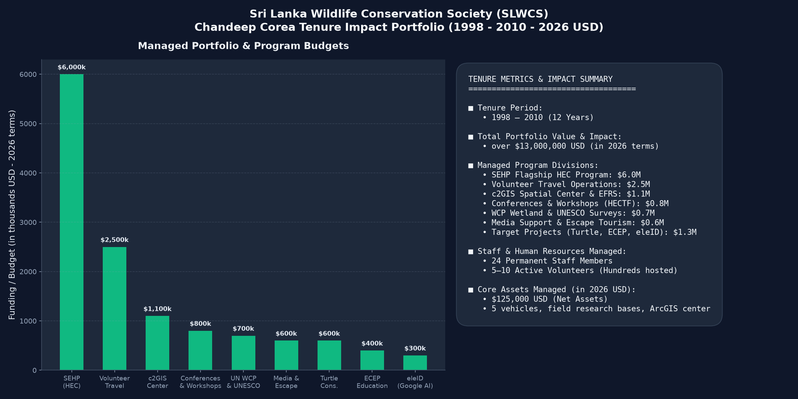

# SLWCS Professional Background Repository

This repository documents integrated technical, conservation, and community-impact work delivered with the Sri Lanka Wildlife Conservation Society (SLWCS), primarily during 1998–2010.

It highlights a practice-based leadership track that combined field implementation, geospatial systems, applied research, and community-facing program design to reduce human–wildlife conflict and strengthen conservation outcomes.

## Key Background Highlights

- Led integrated conservation-technology programs with measurable community relevance amounting to over USD 13 million (corrected to 2026 USD)
- Spearheaded the **UN Award-winning SEHP program**  
- Established the **c2GIS hub** for conservation planning and decision support  
- Advanced **Google-funded eleID AI** wildlife identification initiatives  
- Contributed to the **patented eleAlert** warning and risk communication framework
- Co-developed the **Elephant Walk-Through Hotel Concept** and managed escape tourism and volunteer travel initiatives
- Co-authored the published **Ivey / Harvard Business School Case Study: Elephant Walk Thru** (Product #904M52)
- Coordinated multiple international media programs (National Geographic, Discovery, Nature, etc.) and an international short film
- Oversaw operations at 3 field sites and 2 international offices, managing local staff, builders, consultants, researchers, students, and PhD candidates
- Hosted international and local dignitaries and funding agency visits

## Tenure Portfolio & Impact Metrics (1998 - 2010)

## Quick Navigation

- [Profile Overview](docs/profile-overview.md)  
- [Key Achievements](docs/key-achievements.md)  
- [Projects](projects/README.md)  
- [Publications & Presentations](publications/publications.md)  
- [Roles & Responsibilities](experience/roles-and-responsibilities.md)  
- [Skills & Competencies](docs/skills-and-competencies.md)  
- [Career Timeline](docs/timeline.md)  
- [Source Reports](docs/sources.md)  
- [Using This Repository with AI Agents](docs/ai-agent-usage.md)

## Source Documents Included in Repo

- `1995-2005 SLWCS Annual Report.pdf`  
- `1995-2005-SLWCS-Annual-Report-ocr.pdf` (Searchable OCR Version)  
- `2006-2008 SLWCS Annual Report.pdf`  
- `2006-2008-SLWCS-Annual-Report-ocr.pdf` (Searchable OCR Version)  

## Notes

- Publications are intentionally consolidated in a single file for easier referencing.  
- Historical content may include references to internal reports, draft materials, presentations, and archived documentation.

